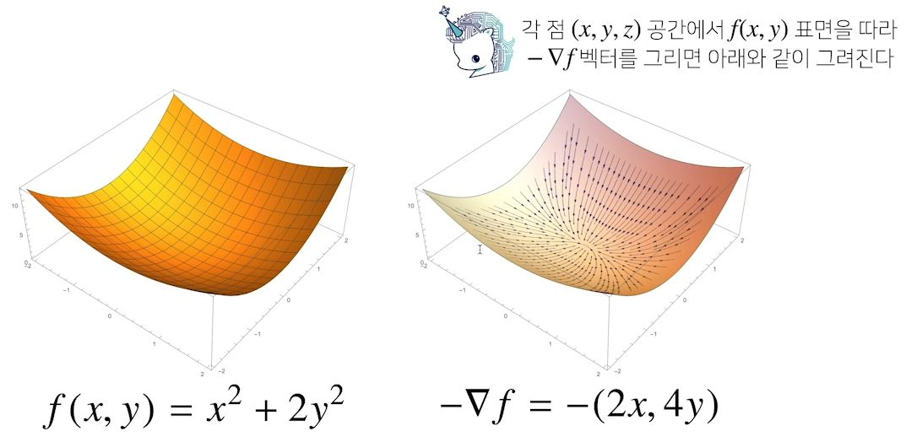

# [AI Math 3강] 경사하강법(순한맛)
### 배운점
- `syspy.diff(([수식]), [미분 할 변수명(?!)]`함수를 통해 코드로 미분 문제를 해결한다.
- 미분을 통해 경사하강법을 배웠다.
- 잘 알지 못했던, nabla라는 수식을 배우게 되었다.
---
#### 미분(differentiation)이란?
- 미분은 변수의 움직임에 따른 함수값의 변화를 측정하기 위한 도구로 최적화에서 제일 많이 사용하는 기법이다.


> 미분은 변화율의 극한으로 정합한다.

```python
import syspy as sym
from sympy.abc import x

sym.diff(sym.poly*x**2 + 2*x + 3),x) # x로 미분하라!!
```
#### 미분은 어디서 쓸까?

- 한 점에서 접선의 기울기를 알면 어느 방향으로 점을 움직여야 함수값이 증가하는지/감소하는지 알 수 있다.


- 미분값을 더하면 경사상승법(gradient ascent)이라 하며 함수의 극대값의 위치를 구할 때 사용.
- 반대로, 미분값을 빼면 경사하강법(gradient descent)이라 하며 함수의 극소값의 위치를 구할 때 사용.
- 경사 상승 / 경사 하강 방법은 극값에 도달하면 움직임을 멈춘다.

#### 경사하강법: 알고리즘
```python
Input: gradient, init, lr, eps, Output: var
--------------------------------------------
# gradient: 미분을 계산하는 함수
# init: 시작점, lr: 학습률, eps: 알고리즘 종료조건

var = init
grad = gradient(var)
while(abs(grad) > eps:
	var = var - lr * grad
    grad = gradient(var)
```
#### 변수가 벡터이면요?
- 미분은 변수의 움직임에 따른 함수값의 변화를 측정하기 위한 도구로 최적화에서 제일 많이 사용하는 기법입니다.
- 벡터가 입력인 다변수함수의 경우 편미분(partial differentiation)을 사용한다.
```python
import syspy as sym
from sympy.abc import x, y

sym.diff(sym.poly(x**2 + 2*x*y + 3) + sym.cos(x + 2*y), x)
```
> 2*x + 2*y - sin(x + 2*y)
- 각 변수 별로 편미분을 계산한 그레디언트(gradient)백터를 이용하여 경사하강/경사상승법에 사용할 수 있다.<br> d 차원의 벡터는 d 번의 편미분을 할 수 있다.
- nabla 기호는 다변수를 입력으로 가지는 함수에 그레디언트 벡터를 표시하는 것.


<br>


