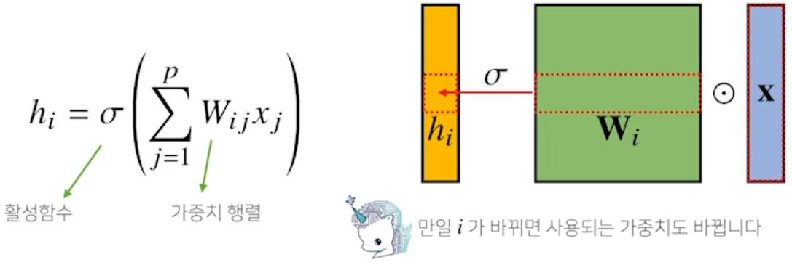
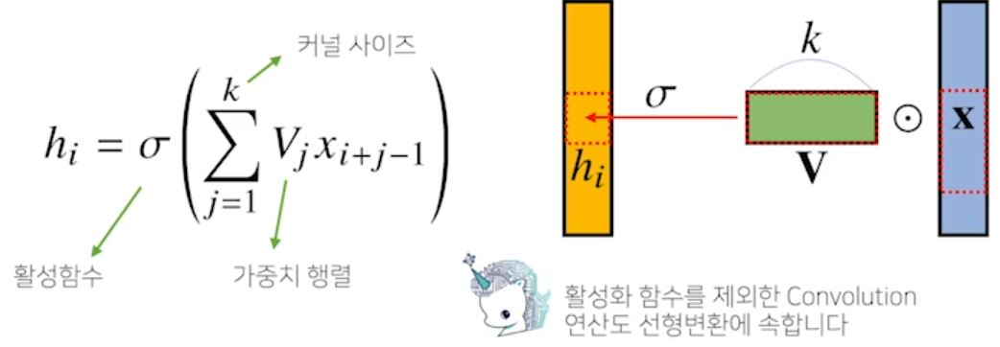
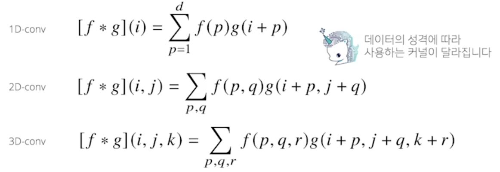
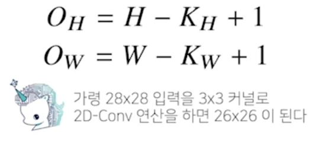
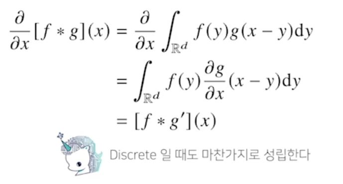

# [AI Math 9강] CNN 첫걸음
#### Convolution 연산 이해하기
- 지금까지 배운 다층신경망(MLP)은 각 뉴런들이 선형모델과 활성함수로 모두 연결된 (fully connected) 구조였다.

 

#### Convolution 연산 이해하기
- Convolution 연산은 이와 달리 커널(kernel)을 입력 벡터 상에서 움직여가면서 선형모델과 합성함수가 적용되는 구조.

 

- Convolution 연산의 수학적인 의미는 신호(signal)를 커널을 이용해 국소적으로 증폭 또는 감소 시켜서 정보를 추출 또는 필터링하는 것.<
참고: http://195.134.76.37/applets/AppletConvol/Appl_Convol2.html

 

- 커널은 정의역 내에서 움직여도 변하지 않고(translation invariant) 주어진 신호에 국소적(local)으로 적용한다.

#### 다양한 차원에서의 Convolution
- Convolution 연산은 1차원뿐만 아니라 다양한 차원에서 계산 가능하다.

 

#### 2차원 Convolution 연산 이해하기
- 2D-Conv 연산은 이와 달리 커널(kernel)을 입력벡터 상에서 움직여가면서 선형 모델과 합성함수가 적용되는 구조다.
- Element wise product

 

- 입력 크기를 (H,W), 커널 크기를 (K_H,K_W), 출력 크기를 (O_H,O_W)라 하면 출력 크기는 다음과 같이 계산된다.

 

- 채널이 여러개인 2차원 입력의 경우 2차원 Convolution을 채널 개수만큼 적용한다고 생각하면 된다.
> 입력 채널 개수 == 커널 채널 개수

#### Convolution 연산의 역전파 이해하기
- Convolution 연산은 커널이 모든 입력 데이터에 공통으로 적용되기 때문에 역전파를 계산할 때도 convolution 연산이 나오게 된다.

 

